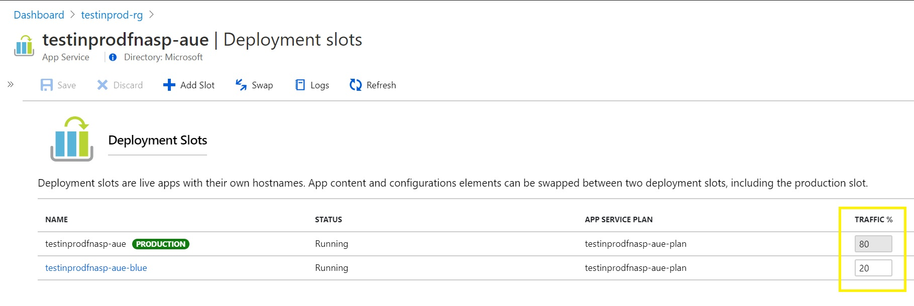
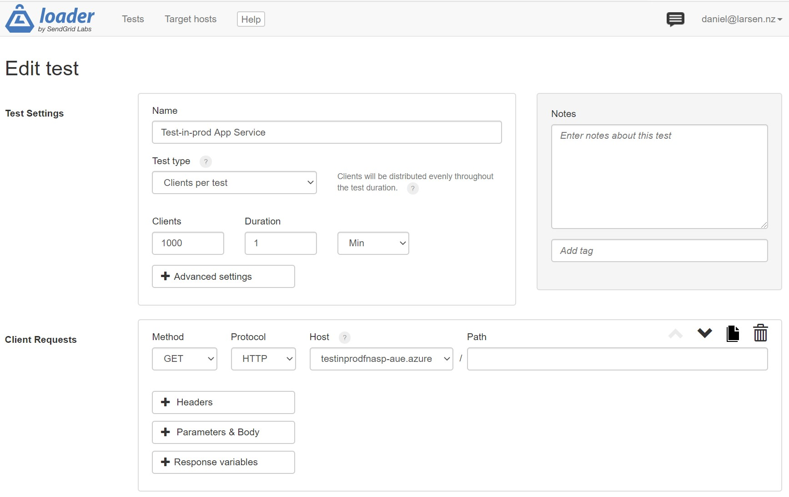
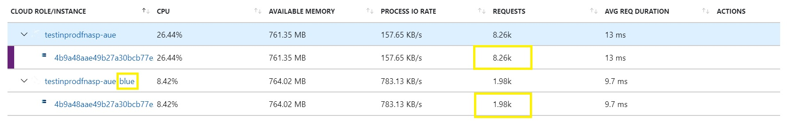

# Test in Prod

This example demonstrates "blue-green" deployments and "test-in-prod" using Staging Slots in Azure App
Services and Azure Premium Functions.

> **Note:** Unfortunately there is a bug in Azure Premium Functions so that traffic routing (required for test-in-prod)
> does not work. See [Premium Functions not honoring Slot Traffic Routing settings](https://github.com/Azure/azure-functions-host/issues/6086).
> The work-around is to use a dedicated App Service Plan to host the Function App.

## Getting started

You will need:

* An Azure Subscription
* PowerShell
* az CLI
* A [loader.io] account

### Deploy the environment

There are three deployment scripts to choose from:

* [deploy.ps1](./deploy.ps1) - Deploys an App Service Plan and an App Service
* [deploy-fn-premium.ps1](./deploy-fn-premium.ps1) - Deploys a Premium Function plan and a Function
  App (see note above)
* [deploy-fn-dedicated.ps1](./deploy-fn-dedicated.ps1) - Deploys a dedicated App Service Plan and
  a Function App.

1. Open a deploy script and edit the variables as required
1. Run the script, e.g.

```
./deploy.ps1
```



### Create a Load test

In this example we use [loader.io]. 

1. Create a new Target Host
1. Copy the validation key into the deploy script
1. Run the deploy script again
1. When the deploy script has completed, wait a few seconds and then validate the Target Host in loader.io
1. Create a new Test



Start with a "Clients per test" of 1,000 for 1 minute. 

* If you have deployed an App Service, the path is `/`
* If you have deployed a Function App, the path is `/api/GetHealth`

Run the test and observe the percentage of requests being routed to each slot in Application Insights. 



## Links

Set up staging environments in Azure App Service: Route Traffic: <https://docs.microsoft.com/en-us/azure/app-service/deploy-staging-slots#route-traffic>

[loader.io]:https://loader.io/