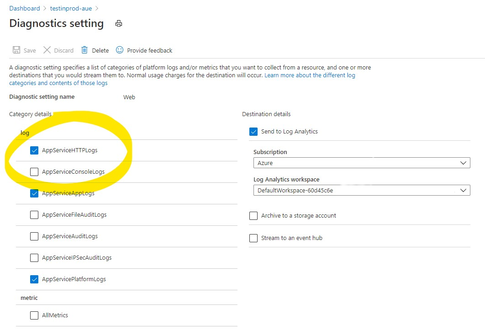
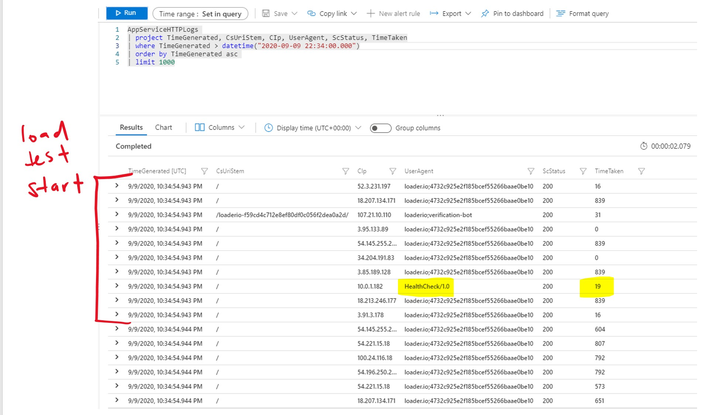
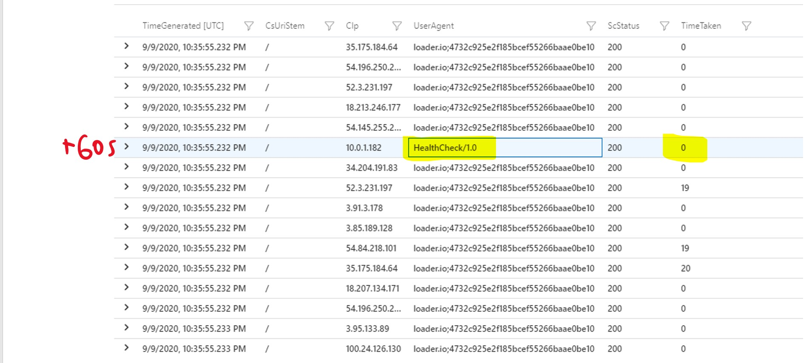
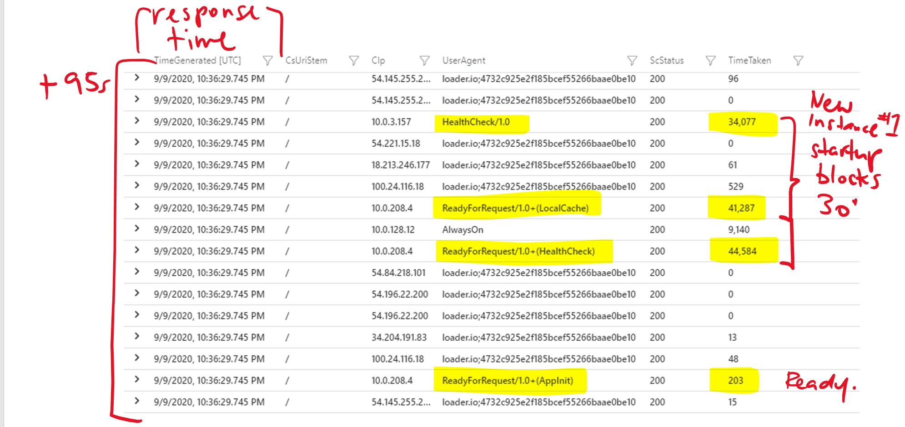
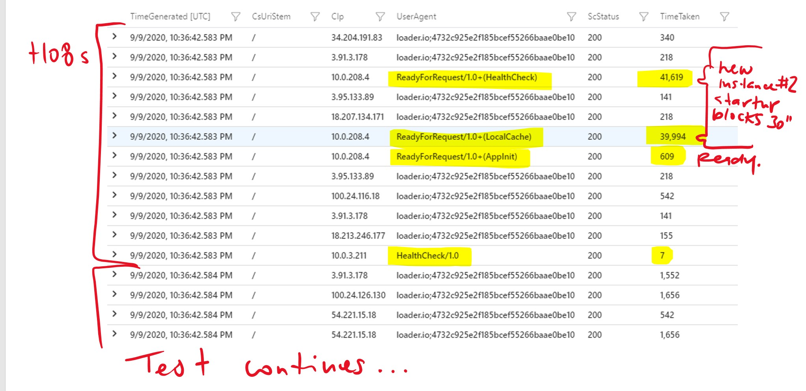
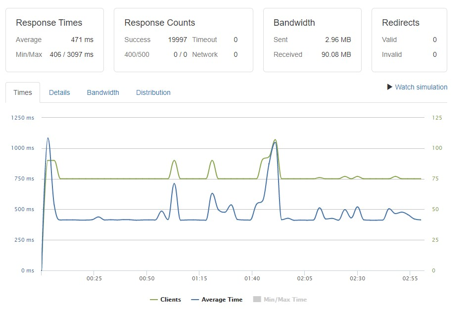

# App-init, Health-check, Auto-heal... oh my!

This article is about how to configure App-init and Health-check features in Azure App Services to ensure that a cold instance does not receive production traffic. There is a good overview of these features in [The Ultimate Guide to Running Healthy Apps in the Cloud].

## TL;DR

* App Startup should block until the app and it's dependencies are warm. This is the only way (I have found) to ensure a cold instance does not receive load.
* If the first request to a cold instance responds with _any_ status (including 500) it will start to recieve production traffic
* Health checks will _eventually_ but not immediately remove an unhealthy instance from production
* Implementing an `IStartupFilter` is the proper way to warm up an app and its dependencies
* In Premium Functions you can use the new [Warmup trigger]
* In Dedicated and ASE Function you can roll your own warmup Function

## Overview

In my experience, the only way to prevent an App Service (Web App or Function App) from being put into production (by the App Services load balancer) until it is ready, is to configure **Application Initialization**. Just configuring a health-check by itself won't guarantee the app won't receive production traffic.

### My PoC environment

I used a slightly modified version of this script: [appserviceplan-test-in-prod/deploy.ps1](/.appserviceplan-test-in-prod/deploy.ps1)

* The Production slot receives 100% of traffic
* Health-check is set to `'/'`
* `'/'` is the default path for `appInit` so I don't need to configure it

### Configuring diagnostic logs

The best way to understand what is going on is to turn on App Service **Diagnostic logs** and send them to Log Analytics so that we can query them using Kusto Query Language. Specifically, enable the **AppServiceHTTPLogs** log category.



### Synchronously blocking startup with `IStartupFilter`

> 📖 [Exploring IStartupFilter in ASP.NET Core]. 

* Synchronously blocking startup until all IO dependencies have been initialised will prevent as instance of an app from taking production load. 
* Use a Startup Filter as [described here](https://andrewlock.net/exploring-istartupfilter-in-asp-net-core/) and [implemented here](https://github.com/DanielLarsenNZ/HelloAspDotNetCore/blob/master/DelayStartupFilter.cs) (but don’t `Thread.Sleep()`!)

### Running the load test

Run a Load test on the App Service while it is scaling up. I point <https://loader.io> at my PoC app and manually scale-up, in this case **from 1 to 3 instances**. Note that my PoC app has a **30 seconds artificial startup delay** implemented as an instance of `IStartupFilter`. This startup filter will **block the first request to the application** until the filter has completed.

## Analysis

Once the test has completed we can analyse the probe requests in Log Analytics to see what is going on. Here is my KQL which filters the web logs to the three minutes that the load test ran for, and to only display requests from the app-init, health check and always-on probes:

```
AppServiceHTTPLogs 
| project TimeGenerated, CsUriStem, CIp, UserAgent, ScStatus, TimeTaken
| where TimeGenerated between (datetime("2020-09-09 22:34:00") .. datetime("2020-09-09 22:38:00"))
| where UserAgent contains "init" or UserAgent contains "health" or UserAgent contains "always" or UserAgent contains "ReadyForRequest"
| order by TimeGenerated asc 
| limit 1000
```

The User-Agent strings of interest are: 

* `AlwaysOn`
* `ReadyForRequest/1.0+(AppInit)`
* `HealthCheck/1.0`
* `ReadyForRequest/1.0+(HealthCheck)`
* `ReadyForRequest/1.0+(LocalCache)`

In the results we observe the load test starting at **10:34:54** and a regular `HealthCheck` probe.



60 seconds later we observe another regular `HealthCheck` probe.



At **10:36:29** we see a third regular `HealthCheck` probe complete. This one caught the first new instance starting up, which took 34 seconds to complete (due to the artificial delay in the Startup filter). In the same millisecond we observe three `ReadyForRequest` probe requests complete; `LocalCache`, `HealthCheck` and `AppInit`. They all complete at the same time because Startup has stopped blocking.



At **10:36:42** we observe the same sequence again; three `ReadyForRequest` probes and a regular `HealthCheck` probe all completeing in the same millisecond because the Startup filter on the second new instance has stopped blocking.



The test continues successfully until completion. 



_(Ignore the lumpy performance on this chart. It's because I ran the test on Standard SKU.)_

I can confirm that the two new instances are not being introduced into production load because:

* The timeout on the Load Test is 10 seconds. I see no timeouts in the test results.
* I see no requests greater than a couple of seconds duration in Application Insights performance (request) logs.


This is a healthy application when scaling under load.

## What about Auto-heal?

My personal advice is to not mess with the Auto-heal defaults except in exceptional circumstances. I view custom auto-heal settings as a last (desparate) effort to keep a web farm healthy when there is no possibility of optimising the code.

[The Ultimate Guide to Running Healthy Apps in the Cloud]:https://azure.github.io/AppService/2020/05/15/Robust-Apps-for-the-cloud.html
[Exploring IStartupFilter in ASP.NET Core]:https://andrewlock.net/exploring-istartupfilter-in-asp-net-core/
[Warmup trigger]:https://docs.microsoft.com/en-us/azure/azure-functions/functions-bindings-warmup?tabs=csharp