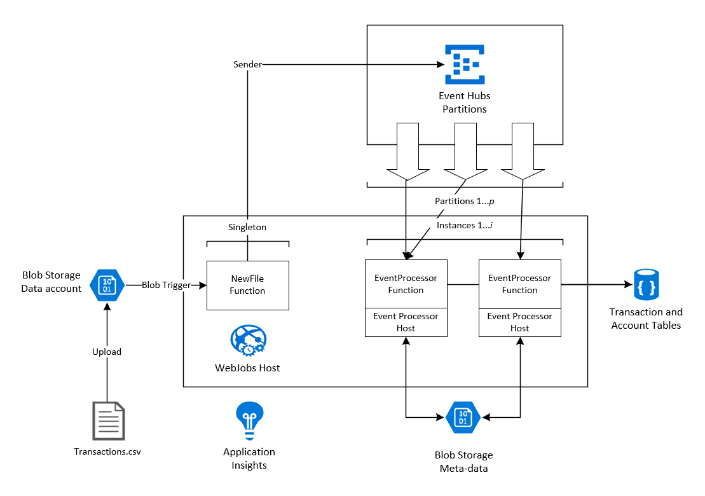
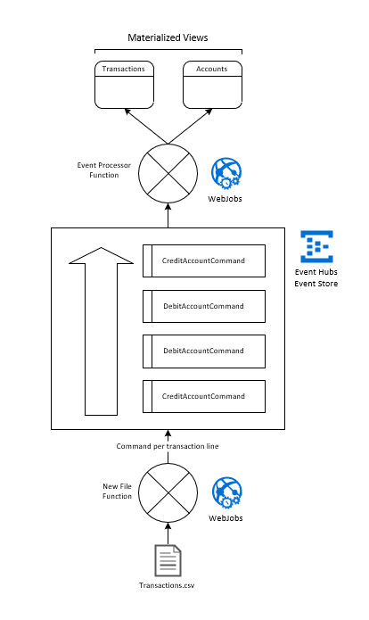

# Messaging

## Event Hubs on WebJobs

This solution deploys an _Event Processor Host_ running on an _WebJobs Host_, as an alternative to
using the _Event Hubs Trigger_ for Functions, when more configuration and monitoring of the underlying
host is desired.

Blob storage, Event Hubs, Web Jobs and a mock database are combined to build a simple Event Sourcing
pipeline (using Event Hubs as an Event Store).

### Logical architecture



### Event sourcing pipeline



### Getting started

1. Install PowerShell
1. Install `az` CLI
1. Install `dotnet` SDK
1. `git clone` this repo
1. `cd` to this folder in a PowerShell terminal and type:

```powershell
> ./deploy.ps1
```

Deploys a Resource Group into your Azure Subscription with the following resources:

* Storage Account for WebJobs (meta data)
* Storage Account for Data
* Applications Insights
* App Service Plan and Web App
* Event Hubs namespace and Event Hub

The script also packages and publishes the `Examples.Pipeline.WebJobs` app and configures App Settings.
Finally the script uploads a test file to kick off the pipeline processing.

### Things to note

* `Examples.Pipeline.WebJobs` is a .NET Core 3 Console app (packaged as a DLL). It incorporates the
  _WebJobs Host SDK_ which provides runtime host functionality.
* The command `host.RunAsync()` in `Program.cs` will run continuously in an App Service instance. 
* Each instance of the App Service will run an instance of the Host, enabling scale-out.
* The WebJobs Host binds the Functions, Triggers and Bindings that it discovers in the library and creates
  triggers to respond to events (just like Azure Functions does, but completely self-contained).
* Functions can be defined as Singletons. The "New File" Function operates as a Singleton.
* _Event Processor Host_ is an intelligent client that registers clients for each partition, automatically
  scales in/out, manages checkpoints and recovers from failures.
* The Event Hubs client library is used (instead of an output binding) for sending Events for better configuration, performance and
  monitoring. 

### Background

Most Azure users will be familiar with [Azure Functions], an event driven, server-less experience on
Azure. Functions is also an SDK and Host which can run anywhere (in a container, on your desktop, in
your cloud). Functions is powered by the [Azure WebJobs SDK], the "core" of the Azure Functions runtime 
and many bindings.

Some scenarios call for more control and customisation over the Host than Functions can offer. For example,
Azure Event Hubs requires a stateful _Event Processor Host_ (for receiving messages) and it can be difficult
to configure, monitor and debug this Host when it is abstracted away by Functions. From the [WebJobs
Host docs]: 

_The host is a runtime container for functions. It listens for triggers and calls functions. In version 3.x, the host is an implementation of IHost. You create a host instance in your code and write code to customize its behavior._

_This is a key difference between using the WebJobs SDK directly and using it indirectly through Azure Functions. In Azure Functions, the service controls the host, and you can't customize the host by writing code. Azure Functions lets you customize host behavior through settings in the host.json file. Those settings are strings, not code, and this limits the kinds of customizations you can do._

### Gotchas

Read [fun-with-appsettings](/docs/fun-with-appsettings.md).

Make sure `BatchCheckpointFrequency` is set to default of 1, otherwise you may wonder why some of your
checkpoints are not being committed! (like I did for about 3 hours).

## Service Bus

Service Bus has a monotonic sequence number: <https://docs.microsoft.com/en-us/azure/service-bus-messaging/service-bus-messages-payloads><br/>
_The sequence number is a unique 64-bit integer assigned to a message as it is accepted and stored by 
the broker and functions as its true identifier. For partitioned entities, the topmost 16 bits reflect 
the partition identifier. Sequence numbers monotonically increase and are gapless. They roll over to 
0 when the 48-64 bit range is exhausted. This property is read-only._

You can forward Queues and Subscriptions. Forwarding topics decouples senders from receivers: <https://docs.microsoft.com/en-us/azure/service-bus-messaging/service-bus-auto-forwarding>

## Functions

### Gotchas

You can only have one registered Service Bus listener (Connection + Queue / Subscription combination) 
per Function host.

## Links and references

### Event Hubs

Processing 100,000 events per second on Azure Functions: <https://azure.microsoft.com/en-au/blog/processing-100-000-events-per-second-on-azure-functions/>

### Event Sourcing

Command and Query Responsibility Segregation (CQRS) pattern example: <https://docs.microsoft.com/en-us/azure/architecture/patterns/cqrs#example>

Event Sourcing pattern example: <https://docs.microsoft.com/en-us/azure/architecture/patterns/event-sourcing#example>

### De-dupe, ordering

In order event processing with Azure Functions <https://medium.com/@jeffhollan/in-order-event-processing-with-azure-functions-bb661eb55428>

Bend Message Deduplication on Azure Service Bus to Your Will: <https://weblogs.asp.net/sfeldman/bend-message-deduplication-on-azure-service-bus-to-your-will>

### Event Processor Host

Event processor host: <https://docs.microsoft.com/en-us/azure/event-hubs/event-hubs-event-processor-host>

Programming guide for Azure Event Hubs: <https://docs.microsoft.com/en-us/azure/event-hubs/event-hubs-programming-guide>

Implement the IEventProcessor interface: <https://docs.microsoft.com/en-us/azure/event-hubs/event-hubs-dotnet-standard-getstarted-send#implement-the-ieventprocessor-interface>

Checkpointing: <https://docs.microsoft.com/en-us/azure/event-hubs/event-hubs-event-processor-host#checkpointing>

Azure Functions and Event Hubs: Optimising for Throughput: <https://medium.com/@iizotov/azure-functions-and-event-hubs-optimising-for-throughput-549c7acd2b75>

Reliable Event Processing in Azure Functions: <https://hackernoon.com/reliable-event-processing-in-azure-functions-37054dc2d0fc>

Provide a configurable retry policy for event hub triggered functions: <https://github.com/Azure/azure-webjobs-sdk/issues/1597>

### WebJobs host

Get started with the Azure WebJobs SDK for event-driven background processing: <https://docs.microsoft.com/en-us/azure/app-service/webjobs-sdk-get-started>

Azure Event Hubs bindings for Azure Functions: <https://docs.microsoft.com/en-us/azure/azure-functions/functions-bindings-event-hubs#packages---functions-2x>

Azure Webjobs SDK repo: <https://github.com/Azure/azure-webjobs-sdk/wiki>

Azure WebJobs SDK Extensions repo: <https://github.com/Azure/azure-webjobs-sdk-extensions>

Singleton Attribute: <https://github.com/Azure/azure-webjobs-sdk/blob/b798412ad74ba97cf2d85487ae8479f277bdd85c/src/Microsoft.Azure.WebJobs/SingletonAttribute.cs>

### Performance settings

WebJobs Configuration Settings: <https://github.com/projectkudu/kudu/wiki/WebJobs#configuration-settings>

### WebJobs Kudu

Reference: <https://github.com/projectkudu/kudu/wiki/WebJobs>

[WebJobs Host docs]:(https://docs.microsoft.com/en-us/azure/app-service/webjobs-sdk-how-to#webjobs-host)
[Azure Functions]: https://github.com/Azure/Azure-Functions
